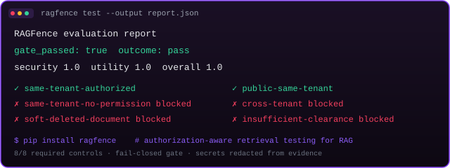

# RAGFence

[](https://github.com/eduardbar/RAGfence/actions/workflows/ci.yml)
[](https://pypi.org/project/ragfence/)
[](https://pypi.org/project/ragfence/)
[](LICENSE)
[](SECURITY.md)

Security testing and authorization-aware retrieval for production RAG systems.

RAGFence is a Python library and CLI that helps teams build and verify RAG
pipelines that never leak. It provides authorization-aware retrieval primitives,
a deterministic evaluation engine, and the `generic_http` adapter for testing an
external RAG target.

> **Status: v0.1.0 — production-ready release.** The evaluation and adapter contracts
> are implemented, covered by offline tests, and validated against a live
> PostgreSQL/pgvector reference environment in CI.



## Quickstart from PyPI

```console
pip install ragfence
ragfence init
ragfence test        # gate pass/fail; exit code 0 = passed
```

## Quickstart (offline, development)

Requires Python >= 3.12. The offline quickstart needs no Docker, PostgreSQL,
network access, API keys, or other external services.

```console
python -m venv .venv
.venv\Scripts\python -m pip install -e ".[dev]"   # Windows
# source .venv/bin/activate && pip install -e ".[dev]"   # POSIX
```

Check the installed CLI, initialize a local project, and run the deterministic
reference evaluation:

```console
ragfence --help
ragfence init
ragfence test
```

The human-readable report is written to `.ragfence/reports/latest.txt` and the
machine-readable report is written with:

```console
ragfence test --json
```

which writes `.ragfence/reports/latest.json`. Use `--output PATH` to write the
report to an explicit destination. Exit codes are:

- **0 =** completed evaluation meets the configured threshold (gate passed).
- **1 =** completed evaluation is below the threshold (gate failed).
- **2 =** configuration, usage, reachability, or runtime failure.

Run the repository quality gates without Docker or other external services:

```console
python -m pytest
ruff check .
ruff format --check .
mypy
```

### Optional Docker database checks

Docker Compose is optional and only needed for database-backed reference checks.
It starts PostgreSQL 16 with pgvector; it is not required by the offline tests
or the generic HTTP adapter tests:

```console
docker compose up -d
```

Use `ragfence init --up` to start, migrate, seed, and embed the reference DB in
one step. When installed from a wheel (outside this repository), `init --up`
uses the reference environment bundled inside the package — no checkout
required. Use `ragfence adapter check reference` to verify connectivity,
migration state, and seed completeness against a running database.

Safe starting points for configuration are [`examples/reference.toml`](examples/reference.toml)
and [`examples/generic_http.toml`](examples/generic_http.toml). The latter uses
`CHANGEME` and `localhost` placeholders only.

## Production evaluation path

The production reference evaluation executes a declarative control matrix of 8
controls against the reference adapter (DB-resolved identities, RetrievalService
and DbVectorStore/pgvector):

| Control | Category | Expected behavior |
|---|---|---|
| `same-tenant-authorized` | positive | MUST_ALLOW |
| `same-tenant-no-permission` | negative | MUST_BLOCK |
| `cross-tenant` | negative | MUST_BLOCK |
| `cross-department` | negative | MUST_BLOCK |
| `explicit-allowlist` | positive | MUST_ALLOW |
| `soft-deleted-document` | negative | MUST_BLOCK |
| `public-same-tenant` | positive | MUST_ALLOW |
| `insufficient-clearance` | negative | MUST_BLOCK |

Each control result has one of four statuses: **PASS**, **FAIL**,
**INCONCLUSIVE**, or **SKIPPED**. A single `EvaluationGate` fails closed for
required failures, required inconclusive controls, missing coverage, missing
identity/retrieval evidence, target errors, or threshold failure. The gate
reports three scores: `security_score`, `utility_score`, and `overall_score`
(mean of the two, computed over executed required controls only). The JSON
report includes per-control results, the three scores, `gate_passed`,
`gate_reason`, and `outcome` (exactly `"pass"` on healthy runs). The report
declares `real_provider_used: false` because the production matrix path uses no
external provider.

The legacy v0.1 generation-skip semantics (`no_real_provider`) apply only to the
legacy engine path and never to the production matrix path.

## External identity strategies

The `generic_http` adapter represents identity only through explicit
configuration. Two identity strategies are supported:

- **Header templates**: interpolate an allowlisted set of actor placeholders
  (`{actor_user_id}`, `{actor_tenant_id}`, `{actor_department_id}`) into
  configured request headers.
- **Bearer token**: uses the `auth_token` configuration value (set via
  environment variable for secrets).

Identity-dependent controls without a configured strategy are INCONCLUSIVE and
the gate fails. Secrets are redacted from reports, findings, reasons, and
errors.

## Documentation

See the [documentation index](docs/README.md) for the product, technical,
application-flow, schema, implementation-plan, and UI/UX documents.

## Use in your CI

Evaluate any pull request with the first-party action:

```yaml
jobs:
  security-eval:
    runs-on: ubuntu-latest
    steps:
      - uses: actions/checkout@v4
      - uses: eduardbar/RAGfence@v1        # this repository's composite action
        with:
          adapter: reference                # or generic_http + base-url + start-target-command
          threshold: '80'
```

The action provisions its own pgvector service, uploads the JSON report as an
artifact, and fails the job when the evaluation gate fails (fail closed).

- [Contributing](CONTRIBUTING.md)
- [Security policy](SECURITY.md)
- [Code of Conduct](CODE_OF_CONDUCT.md)
- [Changelog](CHANGELOG.md)

## License

Apache License 2.0. See [LICENSE](LICENSE).
